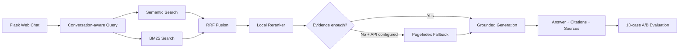

# Bài tập nhóm — La Bàn Hạ Long RAG Chatbot

## Mục tiêu và phạm vi

Nhóm đã hoàn thiện cả hai sản phẩm: chatbot RAG hỏi đáp về Vịnh Hạ Long và evaluation pipeline. Hệ thống dùng 5 bài viết đã crawl thật từ cổng thông tin du lịch Việt Nam, 18 câu golden dataset và hai cấu hình A/B. Không hardcode câu trả lời; mọi câu trả lời được trích từ context và gắn citation tới tài liệu nguồn.

## Sản phẩm 1 — RAG Chatbot

- Giao diện Flask/HTML/CSS/JavaScript responsive tại `web/`.
- Chat history phía client và follow-up memory tối đa 6 lượt.
- Hybrid retrieval: semantic hashing + BM25 + RRF + local reranking.
- Hiển thị source document, retrieval score, đoạn evidence và URL mở nguồn.
- PageIndex là optional fallback; thiếu API key trả trạng thái an toàn.
- Endpoint `GET /api/health` phục vụ kiểm tra demo/deployment.
- Lỗi kỹ thuật chỉ được log ở server, không lộ chi tiết cho client.

## Sản phẩm 2 — RAG Evaluation Pipeline

Framework được chọn là **RAGAS-compatible deterministic offline evaluation**. Bốn metric tương ứng với Faithfulness, Answer Relevance, Context Recall và Context Precision; không cần API trả phí nên kết quả tái lập được. Khi có ngân sách/key kiểm soát, có thể thay evaluator offline bằng RAGAS LLM judge.

- Golden dataset: **18 câu**.
- Config A: hybrid semantic + BM25 + RRF + reranking.
- Config B: dense-only, không reranking.
- Báo cáo: `group_project/evaluation/results.md`.

Kết quả lần chạy gần nhất:

| Metric | Config A | Config B | Δ |
|---|---:|---:|---:|
| Faithfulness | 0.982 | 0.983 | -0.001 |
| Answer relevance | 0.189 | 0.169 | +0.020 |
| Context recall | 0.972 | 0.812 | +0.160 |
| Context precision | 1.000 | 0.933 | +0.067 |
| **Average** | **0.786** | **0.724** | **+0.061** |

Answer relevance vẫn là metric thấp nhất do corpus tiếng Anh khi câu hỏi chủ yếu bằng tiếng Việt; query expansion song ngữ đã được áp dụng nhưng kết quả không được chỉnh tay.

## Kiến trúc hệ thống



## Cấu trúc deliverable

```text
app.py                              # Flask API/server
web/                                # Chat UI
src/task4_chunking_indexing.py      # Persistent index
src/task5_semantic_search.py        # Semantic retrieval
src/task6_lexical_search.py         # BM25
src/task7_reranking.py              # RRF + reranking
src/task8_pageindex_vectorless.py   # Optional fallback
src/task9_retrieval_pipeline.py     # Hybrid pipeline
src/task10_generation.py            # Grounded answer + citations
group_project/evaluation/
├── golden_dataset.json             # 18 Q&A cases
├── eval_pipeline.py                # Metrics + A/B runner
└── results.md                      # Generated report
group_project/tests/                # Group integration tests
```

## Phân công công việc

| Thành viên | MSSV | Nhiệm vụ | Trạng thái |
|---|---|---|---|
| Nguyễn Quang Huy | 2A202601873 | Trưởng nhóm; kiến trúc, tích hợp pipeline, API và kiểm tra end-to-end | Hoàn thành |
| Trương Đình Khoa | 2A202601297 | Thu thập/chuẩn hóa dữ liệu, chunking và persistent index | Hoàn thành |
| Chu Thị Yến Khanh | 2A202601739 | Giao diện chatbot, responsive UI và conversation memory | Hoàn thành |
| Lương Đăng Doanh | 2A202601209 | Semantic/BM25 retrieval, RRF fusion và reranking | Hoàn thành |
| Nguyễn Quốc Việt | 2A202601737 | Grounded generation, citation và evaluation pipeline | Hoàn thành |
| Vũ Quang Tùng | 2A202601545 | Golden dataset, QA, integration tests, báo cáo và README | Hoàn thành |

## Cài đặt và chạy trên Windows PowerShell

```powershell
python -m venv .venv
Set-ExecutionPolicy -Scope Process -ExecutionPolicy Bypass
.\.venv\Scripts\Activate.ps1
python -m pip install --upgrade pip
pip install -r requirements.txt

# Tạo/cập nhật index
python -m src.task4_chunking_indexing

# Chạy chatbot tại http://127.0.0.1:8000
python app.py

# Chạy evaluation và sinh lại results.md
python -m group_project.evaluation.eval_pipeline

# Chạy toàn bộ test
python -m pytest -v
```

## Kiểm thử và tiêu chí hoàn thành

- [x] Chatbot hoạt động và trả citation.
- [x] Follow-up conversation memory.
- [x] Source document, score và URL nguồn.
- [x] Persistent retrieval index, chạy lại không nhân bản chunk.
- [x] Golden dataset có ít nhất 15 câu — hiện có 18.
- [x] Bốn evaluation metrics.
- [x] A/B comparison hai cấu hình.
- [x] Worst performers và recommendations.
- [x] Unit/integration tests không phụ thuộc Internet.
- [x] README có kiến trúc, phân công và lệnh chạy chính xác.

## Hạn chế

- Corpus hiện chủ yếu bằng tiếng Anh trong khi truy vấn demo bằng tiếng Việt.
- Embedding hashing chạy offline và nhẹ nhưng kém mô hình multilingual chuyên dụng.
- PageIndex live API chưa chạy nếu không có `PAGEINDEX_API_KEY`.
- Evaluation offline không thay thế hoàn toàn đánh giá bằng LLM judge có kiểm soát.
- Nội dung du lịch có thể thay đổi; người dùng cần mở URL citation trước khi lập hành trình.

## Bản quyền và attribution

Dữ liệu chỉ dùng cho mục đích học tập. Nội dung thuộc các đơn vị xuất bản; pipeline luôn giữ URL nguồn và không coi nội dung crawl là instruction để thực thi.
