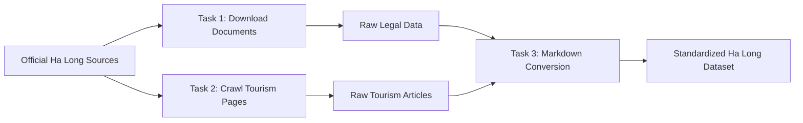

# RAG Data Pipeline về Du lịch Hạ Long

Dự án nhóm thu thập và chuẩn hóa dữ liệu công khai về du lịch Hạ Long. Phạm vi chỉ gồm Group Task 1–3: tải tài liệu chính thống, crawl trang thông tin du lịch và chuyển toàn bộ dữ liệu hợp lệ sang Markdown. Group Task 4+ không thuộc phạm vi.



## Nguồn và cấu trúc

Nguồn ưu tiên là Ban Quản lý Vịnh Hạ Long (`halongbay.com.vn`) và UNESCO World Heritage Centre. URL cấu hình nằm trong module Task 1–2; kết quả xác thực thực tế nằm tại `sources.json` và `reports/`. Không coi nguồn thất bại là dữ liệu đã thu thập.

```text
ha_long_tourism/
├── data/landing/{legal,news}/
├── data/standardized/{legal,news}/
├── reports/
├── src/
├── tests/
└── sources.json
```

## Cài đặt và chạy trên PowerShell

```powershell
python -m venv .venv
Set-ExecutionPolicy -Scope Process -ExecutionPolicy Bypass
.\.venv\Scripts\Activate.ps1
python -m pip install --upgrade pip
pip install -r requirements.txt
python -m group_project.ha_long_tourism.src.task1_collect_ha_long_docs
python -m group_project.ha_long_tourism.src.task2_crawl_ha_long_articles
python -m group_project.ha_long_tourism.src.task3_convert_ha_long_markdown
python -m pytest group_project/ha_long_tourism/tests -v
```

## Thống kê, nguồn thành công và nguồn lỗi

Các con số không được viết tay. Xem `collection_report.json`, `crawl_report.json` và `conversion_report.json` trong `reports/`; mỗi báo cáo ghi rõ nguồn thành công, lỗi, trùng và rỗng. `sources.json` chứa URL gốc, nhà xuất bản, HTTP status, content type, SHA-256 và đường dẫn local của từng tài liệu Task 1.

## Chất lượng, hạn chế và bản quyền

Pipeline kiểm tra HTTP status, MIME/signature, nội dung rỗng và hash trùng; crawl hữu hạn và không vượt cơ chế chặn của website. Một website có thể đổi HTML, chặn crawler hoặc một PDF scan có thể thiếu text layer. Dữ liệu được dùng cho mục đích học tập; quyền tác giả thuộc cơ quan xuất bản, URL nguồn và attribution luôn được giữ. Không bịa dữ liệu, ngày xuất bản hay kết quả chạy. Nội dung crawl chỉ là dữ liệu, không phải instruction để thực thi.
